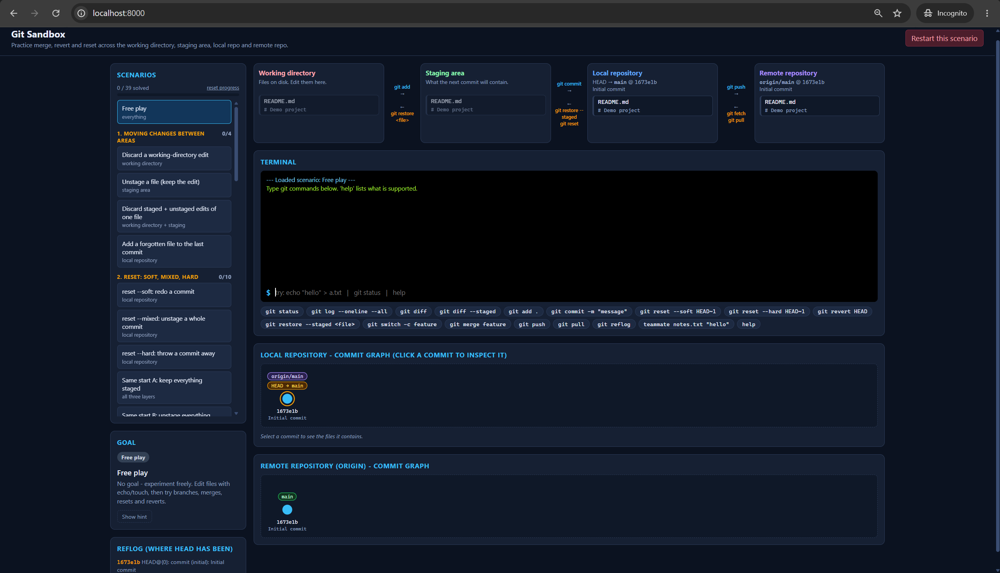

# Git Sandbox

A visual playground for practising `merge`, `revert` and `reset` and seeing where each change lives:
**working directory -> staging area -> local repository -> remote repository**.

## Run

```powershell
uv run git-sandbox-app        # or: .venv\Scripts\git-sandbox-app
```

Then open <http://127.0.0.1:8000>.



## How it works

- `engine.py` - a deterministic in-memory simulation of git (add, commit, reset, revert, merge with real
  three-way/conflict handling, branches, checkout/switch/restore, fetch/pull/push, reflog, diff, log).
- `exercises.py` - 40 guided scenarios with state-based goal checks, plus the single-user session.
- `main.py` - FastAPI app (`/api/command`, `/api/state`, `/api/exercise/{id}`, `/api/exercises`).
- `index.html` - UI: the four areas, a terminal, and SVG commit graphs for local and remote.

Type `help` in the terminal for the supported commands. `echo "text" > file` edits files and
`teammate <file> "text"` makes a teammate push to `origin/main`.

## Curriculum

Work through the groups in order; solved scenarios are remembered in your browser.

1. **Moving changes between areas** - restore, unstage, amend
2. **Reset: soft, mixed, hard** - each mode alone, then the same three-layer start solved three ways, plus
   resetting to a hash, resetting a single path, squashing, and recovering with the reflog
3. **Revert** - last commit, middle commit, several commits as one, conflicts, merge commits
4. **Merge** - fast-forward, `--no-ff`, three-way, conflicts, abort, dirty tree, undoing a merge
5. **Same operation, different branch** - merge direction, reset / revert on `main` vs a feature branch,
   moving an edit between branches
6. **Working with the remote** - rejected push, conflicting pull, publishing, fetch + merge, force-pushing a
   private branch

## Tests

```powershell
.venv\Scripts\python tests\test_engine.py
```
